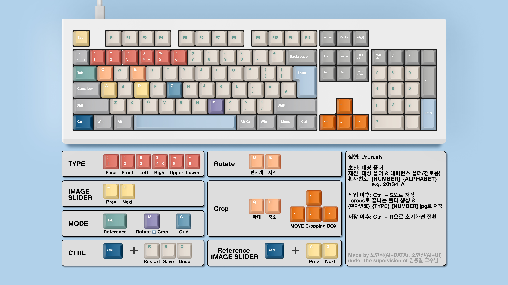

# CRoCs;

**CRoCs** is an AI-assisted framework for the automated classification, rotation correction, and cropping of intraoral images. This project was developed at the Department of Orthodontics, Pusan National University Dental Hospital.

by Hyeonsik Roh\*, Hyeonjin Jo\*, and Yongil Kim<sup>+</sup>   

\* Graduate Student @School of Dentistry, Pusan National University, Republic of Korea  
<sup>+</sup> Professor @Department of Orthodontics, Pusan National University Dental Hospital, Republic of Korea

-----

## Prerequisites

1.  **Download and Install Miniconda**

    You have two options for downloading Miniconda.

      * **Option A: Direct Download (Recommended)**
        Go to the [Miniconda repository](https://repo.anaconda.com/miniconda/) and download the appropriate installer for your operating system (`.exe` for Windows, `.sh` for Linux, `.pkg` for macOS).

      * **Option B: Using the Command Line (Windows)**
        Alternatively, open your terminal and run the following command to download the installer for Windows.

        ```bash
        curl https://repo.anaconda.com/miniconda/Miniconda3-latest-Windows-x86_64.exe --output Miniconda3-installer.exe
        ```

    > After downloading, **run the installer** and follow the on-screen instructions to complete the setup.

2.  **Set Up Conda Environment**
    Create and activate a new Conda environment named `CRoCs`.

    ```bash
    conda init
    conda create -n CRoCs python=3.12
    conda activate CRoCs
    ```

3.  **Install Dependencies**
    Install all the required Python packages from the `requirements.txt` file.

    ```bash
    pip install -r requirements.txt
    ```

-----

## Model Downloads

The release of the pre-trained models is currently under internal discussion.

-----

## Usage

1.  **Make the Script Executable** (Only required for the first time on Linux/macOS)

    ```bash
    chmod +x run.sh
    ```

2.  **Run the Application**

    ```bash
    ./run.sh
    ```

3. **Manual**   
    