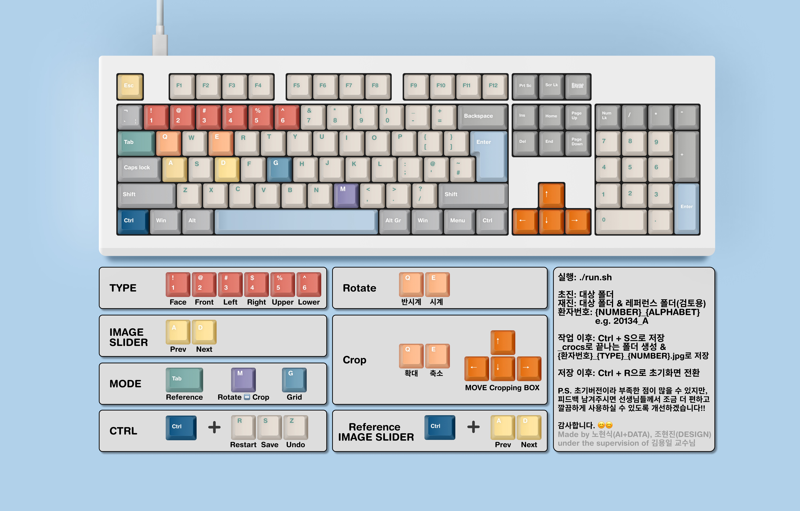

# CRoCs;

**CRoCs** is an AI-assisted framework for the automated classification, rotation correction, and cropping of intraoral images. This project was developed at the Department of Orthodontics, Pusan National University Dental Hospital.

by Hyeonsik Roh\*, Hyeonjin Jo\*, and Yongil Kim<sup>+</sup>   

\* Graduate Student @School of Dentistry, Pusan National University, Republic of Korea  
<sup>+</sup> Professor @Department of Orthodontics, Pusan National University Dental Hospital, Republic of Korea

-----

## Prerequisites

1.  **Download and Install Miniconda**

    You have two options for downloading Miniconda.

      * **Option A: Direct Download (Recommended)**
        Go to the [Miniconda repository](https://repo.anaconda.com/miniconda/) and download the appropriate installer for your operating system (`.exe` for Windows, `.sh` for Linux, `.pkg` for macOS).

      * **Option B: Using the Command Line (Windows)**
        Alternatively, open your terminal and run the following command to download the installer for Windows.

        ```bash
        curl https://repo.anaconda.com/miniconda/Miniconda3-latest-Windows-x86_64.exe --output Miniconda3-installer.exe
        ```

    > After downloading, **run the installer** and follow the on-screen instructions to complete the setup.

2.  **Set Up Conda Environment**
    Create and activate a new Conda environment named `CRoCs`.

    ```bash
    conda init
    conda create -n CRoCs python=3.12
    conda activate CRoCs
    ```

3.  **Install Dependencies**
    Install all the required Python packages from the `requirements.txt` file.

    ```bash
    pip install -r requirements.txt
    ```

-----

## Model Downloads

The release of the pre-trained models is currently under internal discussion.

-----

## Usage

1.  **Make the Script Executable** (Only required for the first time on Linux/macOS)

    ```bash
    chmod +x run.sh
    ```

2.  **Run the Application**

    ```bash
    ./run.sh
    ```

3. **Manual**   
    

-----

## Update logs

1. **2025-08-13, Version 1**
    - Release CRoCs

2. **2025-08-19, Version 2**
    - Parameter Fine-Tuning
        - THUMBNAIL_SIZE: Tuple[int, int]: (600, 400) → (800, 600)
        - CROP_MOVE_RATIO: 0.05 → 0.025
        - CROP_ZOOM_RATIO: 0.05 → 0.025
    - Improved Classification Consistency   
        Enhanced the logic to handle orientation differences between new camera images and existing reference images.
        - Orientation Definitions:
            - Camera Image(mirrored): Upper = Convex, Lower = Concave
            - Reference Image(already flipped): Upper = Concave, Lower = Convex
        - Previous Workflow
            - Camera Image/Reference Image: Image → Predict → Flip vertically
        - Current Workflow
            - Camera Image: Camera Image(mirrored) → Predict → Flip vertically
            - (Ideal) Reference Image: Reference Image(already flipped) → Flip vertically → Predict → Flip vertically
            - (Our) Reference Image: Reference Image(already flipped) → Predict → Exchange Labels(Upper ↔ Lower) without flip vertically
        - Note: A heuristic label swap (Upper ↔ Lower) was implemented for reference images. Unlike images generated by CRoCs, which have the class name embedded in their filenames, the Upper/Lower orientation of pre-existing images cannot be reliably determined. This method ensures classification consistency without altering the original image file.
    - Resized Reference View    
        Enlarged the image display area in the reference mode to show a real-time preview of the final cropped image, enabling users to more easily compare their crop with the reference image.
        - Previous Reference View Layout   
            axes[0].set_position([0.25, 0.35, 0.20, 0.30])   
            axes[1].set_position([0.55, 0.35, 0.20, 0.30])
        - Current Reference View Layout   
            axes[0].set_position([0.08, 0.15, 0.40, 0.60])   
            axes[1].set_position([0.52, 0.15, 0.40, 0.60])
        - Add get_cropped_thumbnail()
        - Modify _update_display_refcompare()
        
